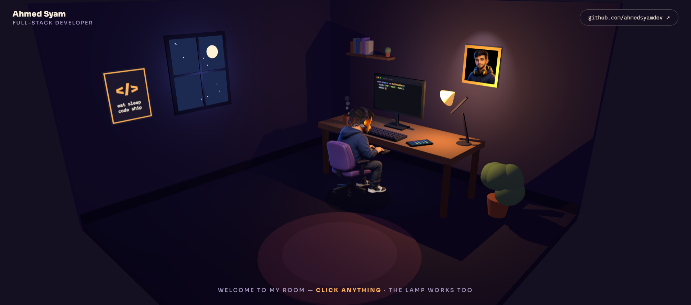

<div align="center">

# Hey, I'm Ahmed Syam 👋

**Full-Stack Developer** — TypeScript · Next.js · Node.js · Flutter

<br/>

<!-- ══ THE ROOM ══ -->
<a href="https://ahmedsyamdev.github.io/ahmedsyamdev/">
  
</a>

### 🛋️ ↑ this is my room — **step inside, it's interactive**

*Built with Three.js in a single file. Click the monitor for my projects, the phone for my stack,*
*the coffee for contact… and yes, the lamp actually works.* 💡

<br/>


</div>

---

## ☕ About me

```ts
const ahmed = {
  role: "Full-Stack Developer",
  location: "Egypt 🇪🇬",
  ownership: "database schema → REST APIs → admin dashboards → pixel-perfect frontends",
  specialty: "bilingual EN/AR, RTL-ready interfaces most devs avoid",
  shipped: ["institutional web platforms", "complete CMS systems", "Flutter apps on both stores"],
  motto: "fix it at the root cause, so it stays fixed",
  status: "open to work 🟢",
};
```

## 🛠️ The stack on my desk

<div align="center">

**Frontend**


**Backend**


**Mobile & DevOps**


</div>

## 📊 Stats

<div align="center">


<br/><br/>


</div>

---

## 🐍 Contribution Graph

<div align="center">
  
</div>

---

## 📫 Let's grab a coffee

<div align="center">

[](mailto:ahmedsyam100221@gmail.com)
[](https://github.com/ahmedsyamdev)

<br/>

**💬 Freelance project, full-time role, or a system that needs fixing at the root — my inbox is open.**

<sub>© 2026 Ahmed Syam · the room is one HTML file, Three.js, no frameworks — <a href="https://github.com/ahmedsyamdev/ahmedsyamdev/blob/main/index.html">view source</a></sub>

</div>
